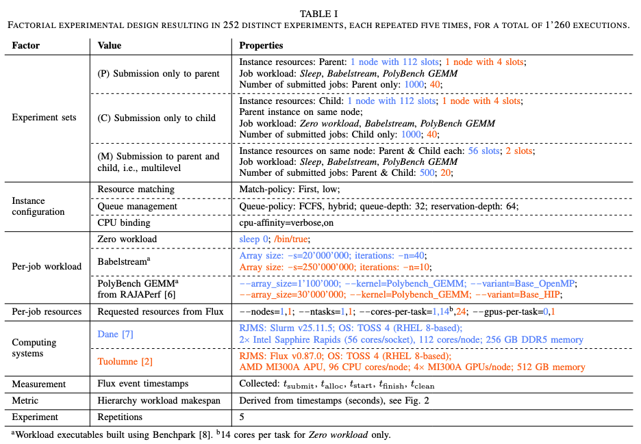

# Artifacts

The following is a description of the artifacts for the paper *"First Insights into the Effects of Scheduling Configurations in Hierarchical Flux Execution"* under review.

**Caveat**: This repository provides scripts and material to execute the experiments and produce plots. However, it **does not include the results of the experiments**.

**Note**: For reproducibility, the file system paths in the scripts need to be adapted accordingly.

## Table of Contents

- [Content of the repository](#content-of-the-repository)
  - [Conda Environments](#conda-environments)
  - [Experiments](#experiments)
  - [Plots](#plots)
  - [Workflow](#workflow)
  - [Workloads](#workloads)
- [References](#references)

## Content of the repository

### [Conda Environments](conda_envs)

- [`plotting.yaml`](conda_envs/plotting.yaml)

Install Miniforge, create the environment, and activate it with:

```
/conda_envs/create_env.sh
```

### [Experiments](experiments)

- TABLE I gives an overview of the factorial design of the experiments:



- For each experiment set (P, C, M), with or without a workload (SW_, SO_), there is a [`doe.py`](/experiments/dane/SO_C/doe.py) file defining the factorial combinations and an [`experiments_table.csv`](/experiments/dane/SO_C/experiments_table.csv) listing all executed experiment configurations for that specific experiment set.

- The [`experiments_overview.csv`](/experiments/dane/experiments_overview.csv) shows the number of experiments for each system.

### [Plots](plots)

The Jupyter notebook [`plots.ipynb`](/plots/plots.ipynb) is used to create the final [figures](/plots/svg/). To have all dependencies available, execute the notebook using the environment defined in [`plotting.yaml`](conda_envs/plotting.yaml).

**Note**: As this repository does not provide results, plots cannot be produced before the experiments have been run.

### [Workflow](workflow)

- To execute the experiments, the defining [`doe.py`](/experiments/dane/SO_C/doe.py) needs to exist. If so, the script [`run.sh`](/workflow/run.sh) executes the specified experiments based on the existing [experiments](/experiments/).

- To be able to execute the workflow, the [workloads](/workloads/) need to have been built. See below for instructions.

- In addition, the paths need to be updated according to your environment in [`paths.py`](/workflow/paths.py) and [`run.sh`](/workflow/run.sh). The pipeline is executed accordingly.

### [Workloads](workloads)

- For each workload and system, there is a wrapper script [`run_workload.sh`](/workloads/dane/babelstream/run_workload.sh) to execute the specific workload called during execution of the [workflow](/workflow/).

- For this to work, the workloads need to have been built by cloning Benchpark [8] and using the example commands in [`benchpark_commands.sh`](/workloads/benchpark_commands.sh) for the designated system.

## References

[2] HPC @ LLNL Tuolumne. <https://hpc.llnl.gov/hardware/compute-platforms/tuolumne>. Accessed August 24, 2026.

[6] RAJAPerf GitHub Repository. <https://github.com/llnl/rajaperf>. Accessed August 24, 2026.

[7] HPC @ LLNL Dane. <https://hpc.llnl.gov/hardware/compute-platforms/dane>. Accessed August 24, 2026.

[8] Benchpark GitHub Repository. <https://github.com/llnl/benchpark>. Accessed August 24, 2026.